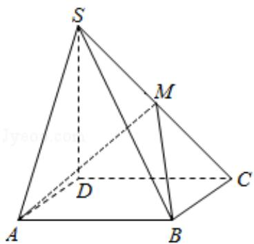

<!-- question-source:start -->
19.（12分）如图，四棱锥S-ABCD中，底面ABCD为矩形，SD⊥底面ABCD，AD= $\sqrt{2}$

，DC=SD=2，点 M 在侧棱 SC 上， $\angle ABM=60^{\circ}$

(I) 证明: M 是侧棱 SC 的中点;

（II）求二面角 S - AM - B 的大小.

<!-- question-source:end -->

![[高中/真题/按年份分类/2009/2009年全国统一高考数学试卷_文科__全国卷ⅰ__含解析版_/解答题/题目/answers/Q00024698A1.md]]
