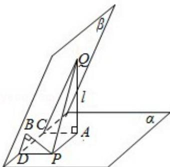

<!-- question-source:start -->
11.（5分）已知二面角 $\alpha - 1 - \beta$ 为 $60^{\circ}$ ，动点 $P$ 、 $Q$ 分别在面 $\alpha$ 、 $\beta$ 内， $P$ 到 $\beta$ 的距离

为 $\sqrt{3}$ ，Q到 $\alpha$ 的距离为 $2\sqrt{3}$ ，则P、Q两点之间距离的最小值为（）

A. 1 B. 2 C. $2\sqrt{3}$ D. 4
<!-- question-source:end -->

![[高中/真题/按年份分类/2009/2009年全国统一高考数学试卷_文科__全国卷ⅰ__含解析版_/选择题/题目/answers/Q00024690A1.md]]
