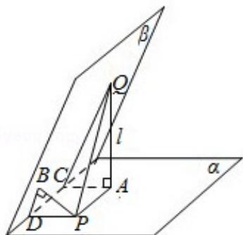

> [!faq]- 2009年全国统一高考数学试卷（文科）（全国卷ⅰ）（含解析版）解析
>
> > [!success]- **【答案】** C
>
> > [!note]- **【分析】**
> > 分别作 $QA \perp \alpha$ 于 A，AC⊥I 于 C，PB⊥β 于 B，PD⊥I 于 D，连 CQ，BD 则 $\angle ACQ = \angle PBD = 60^{\circ}$ ，在三角形 APQ 中将 PQ 表示出来，再研究其最值即可.
>
> > [!note]- **【解析】**
> > 分析】分别作 $QA \perp \alpha$ 于 A，AC⊥I 于 C，PB⊥β 于 B，PD⊥I 于 D，连 CQ，BD 则 $\angle ACQ = \angle PBD = 60^{\circ}$ ，在三角形 APQ 中将 PQ 表示出来，再研究其最值即可.
> >
> > 【
> > 解答】解：如图
> >
> > 分别作 $QA \perp \alpha$ 于 A，AC ⊥ I 于 C，PB ⊥ β 于 B，PD ⊥ I 于 D，
> >
> > 连 CQ，BD 则 $\angle ACQ = \angle PDB = 60^{\circ}$ ，AQ = 2√3，BP = √3，
> >
> > 又 $\because PQ = \sqrt{AQ^2 + AP^2} = \sqrt{12 + AP^2} \geqslant 2\sqrt{3}$
> >
> > 当且仅当 AP=0，即点 A 与点 P 重合时取最小值.
> >
> > 故选：C.
> >
> > 
> >
> > 【点评】本题主要考查了平面与平面之间的位置关系，以及空间中直线与平面之
> > 间的位置关系，考查空间想象能力、运算能力和推理论证能力，属于基础题.
