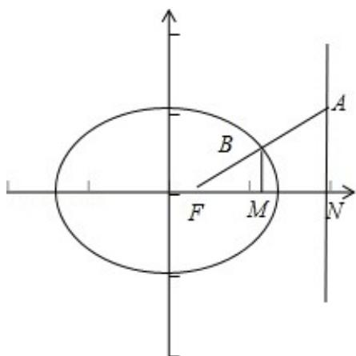

> [!faq]- 2009年全国统一高考数学试卷（文科）（全国卷ⅰ）（含解析版）解析
>
> > [!success]- **【答案】** A
>
> > [!note]- **【分析】**
> > 过点 B 作 BM⊥x 轴于 M，设右准线 I 与 x 轴的交点为 N，根据椭圆的性质
>
> > [!note]- **【解析】**
> > 分析】过点 B 作 BM⊥x 轴于 M，设右准线 I 与 x 轴的交点为 N，根据椭圆的性质
> >
> > 可知 FN=1，进而根据 $\overrightarrow{FA}=3\overrightarrow{FB}$ ，求出 BM，AN，进而可得 $|AF|$ .
> >
> > 【
> > 解答】解：过点 B 作 BM⊥x 轴于 M，
> >
> > 
> >
> > 并设右准线 I 与 x 轴的交点为 N，易知 FN=1.
> >
> > 由题意 $\overrightarrow{\mathrm{FA}} = 3\overrightarrow{\mathrm{FB}}$
> >
> > 故 $FM = \frac{1}{3}$ ，故B点的横坐标为 $\frac{4}{3}$ ，纵坐标为 $\pm \frac{1}{3}$
> >
> > 即 $BM=\frac{1}{3}$ ,
> >
> > 故 AN=1，
> >
> > $$
> > \therefore | A F | = \sqrt {2}.
> > $$
> >
> > 故选：A.
> >
> > 【点评】本小题考查椭圆的准线、向量的运用、椭圆的定义，属基础题.
> >
> > ## 二、填空题（共4小题，每小题5分，满分20分）
