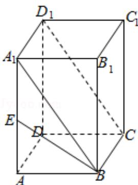

> [!faq]- 2009年全国统一高考数学试卷（文科）（全国卷ⅱ）（含解析版）解析
>
> > [!success]- **【答案】** C
>
> > [!note]- **【分析】**
> > 由 $BA_{1}\|CD_{1}$ ，知 $\angle A_{1}BE$ 是异面直线 BE 与 $CD_{1}$ 所形成角，由此能求出异面直
>
> > [!note]- **【解析】**
> > 解：∵正四棱柱 ABCD - A₁B₁C₁D₁ 中，AA₁=2AB，E 为 AA₁ 中点，
> >
> > $\therefore \mathrm{BA}_{1} \| \mathrm{CD}_{1}$ , $\therefore \angle A_{1}BE$ 是异面直线 $BE$ 与 $CD_{1}$ 所形成角,
> >
> > 设 $AA_{1}=2AB=2$ ，
> >
> > 则 $A_{1}E = 1$ ， $\mathrm{BE} = \sqrt{1^2 + 1^2} = \sqrt{2}$
> >
> > $$
> > A _ {1} B = \sqrt {1 ^ {2} + 2 ^ {2}} = \sqrt {5},
> > $$
> >
> > $$
> > \therefore \cos \angle A _ {1} B E = \frac {A _ {1} B ^ {2} + B E ^ {2} - A _ {1} E ^ {2}}{2 \cdot A _ {1} B \cdot B E}
> > $$
> >
> > $$
> > = \frac {5 + 2 - 1}{2 \times \sqrt {5} \times \sqrt {2}}
> > $$
> >
> > $$
> > = \frac {3 \sqrt {1 0}}{1 0}.
> > $$
> >
> > ∴异面直线 BE 与 CD₁ 所形成角的余弦值为 $\frac{3\sqrt{10}}{10}$ .
> >
> > 故选：C.
> >
> > 
> >
> > 【点评】本题考查异面直线所成角的余弦值的求法, 是基础题, 解题时要认真审题,
> > 注意空间思维能力的培养.
