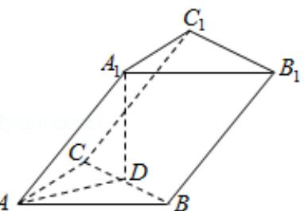
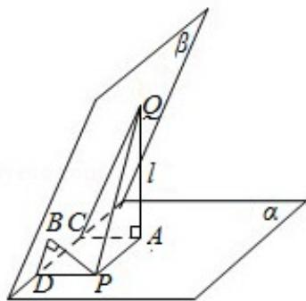

# 2009年全国统一高考数学试卷（理科）（全国卷Ⅰ）

##
一、选择题（共12小题，每小题5分，满分60分）

1. (5 分) 设集合 $A = \{4, 5, 7, 9\}$ , $B = \{3, 4, 7, 8, 9\}$ , 全集 $U = A \cup B$ , 则集合 $C_U(A \cap B)$ 中的元素共有（）
A. 3 个    B. 4 个    C. 5 个    D. 6 个

2. （5分）已知 $\frac{\overline{Z}}{1 + i} = 2 + i$ ，则复数 $z = (\quad)$ A. -1+3i B. 1-3i C. 3+i D. 3-i

3. （5分）不等式 $\left|\frac{x+1}{x-1}\right|<1$ 的解集为（）
A. $\{x\mid0<x<1\}\cup\{x\mid x>1\}$ B. $\{x\mid0<x<1\}$ C. $\{x\mid-1<x<0\}$ D. $\{x\mid x<0\}$

4. (5 分) 已知双曲线 $\frac{x^2}{a^2} - \frac{y^2}{b^2} = 1 (a > 0, b > 0)$ 的渐近线与抛物线 $y = x^2 + 1$ 相切, 则该双曲线的离心率为 ( )

A. $\sqrt{3}$ B. 2

C. $\sqrt{5}$ D. $\sqrt{6}$

5. (5 分) 甲组有 5 名男同学, 3 名女同学; 乙组有 6 名男同学、2 名女同学. 若从甲、
乙两组中各选出 2 名同学, 则选出的 4 人中恰有 1 名女同学的不同选法共有（
）

A. 150种 B. 180种 C. 300种 D. 345种

6. (5分) 设 $\vec{a} \cdot \vec{b} \cdot \vec{c}$ 是单位向量, 且 $\vec{a} \cdot \vec{b} = 0$ , 则 $(\vec{a} - \vec{c}) \cdot (\vec{b} - \vec{c})$ 的最小值为 ( )

A. -2

B. $\sqrt{2} - 2$ C. -1

D. $1 - \sqrt{2}$

7. (5 分) 已知三棱柱 $ABC - A_{1}B_{1}C_{1}$ 的侧棱与底面边长都相等, $A_{1}$ 在底面 $ABC$ 上的射影 $D$ 为 $BC$ 的中点, 则异面直线 $AB$ 与 $CC_{1}$ 所成的角的余弦值为 ( )

A. $\frac{\sqrt{3}}{4}$ B. $\frac{\sqrt{5}}{4}$ C. $\frac{\sqrt{7}}{4}$ D. $\frac{3}{4}$

8. (5 分) 如果函数 $y = 3\cos (2x + \varphi)$ 的图象关于点 $(\frac{4\pi}{3}, 0)$ 中心对称, 那么 $|\varphi|$ 的最小值为 ( )

A. $\frac{\pi}{6}$ B. $\frac{\pi}{4}$ C. $\frac{\pi}{3}$ D. $\frac{\pi}{2}$

9. (5 分) 已知直线 $y = x + 1$ 与曲线 $y = \ln (x + a)$ 相切, 则 $a$ 的值为 ( )
A. 1 B. 2 C. -1 D. -2

10. (5 分) 已知二面角 $\alpha - 1 - \beta$ 为 $60^{\circ}$ , 动点 P、Q 分别在面 $\alpha$ 、 $\beta$ 内, P 到 $\beta$ 的距离为 $\sqrt{3}$ , Q 到 $\alpha$ 的距离为 $2\sqrt{3}$ , 则 P、Q 两点之间距离的最小值为 ( )

A. 1 B. 2 C. $2\sqrt{3}$ D. 4

11. (5 分) 函数 $f(x)$ 的定义域为 $R$ , 若 $f(x + 1)$ 与 $f(x - 1)$ 都是奇函数, 则 ( )

A. $f(x)$ 是偶函数

B. $f(x)$ 是奇函数

C. $f(x) = f(x + 2)$ D. $f(x + 3)$ 是奇函数

12. (5 分) 已知椭圆 C: $\frac{x^2}{2} + y^2 = 1$ 的右焦点为 F, 右准线为 I, 点 A ∈ I, 线段 AF 交 C

于点 B, 若 $\overrightarrow{FA} = 3\overrightarrow{FB}$ , 则 $|\overrightarrow{AF}| = (\quad)$ A. $\sqrt{2}$ B. 2

C. $\sqrt{3}$ D. 3

##

![[高中/真题/按年份分类/2009/2009年全国统一高考数学试卷_理科__全国卷ⅰ__含解析版_/填空题/填空题.md]]
![[高中/真题/按年份分类/2009/2009年全国统一高考数学试卷_理科__全国卷ⅰ__含解析版_/选择题/选择题.md]]
![[高中/真题/按年份分类/2009/2009年全国统一高考数学试卷_理科__全国卷ⅰ__含解析版_/解答题/解答题.md]]
