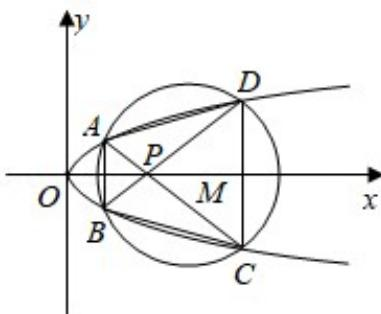

<!-- question-source:start -->
21. （12分）如图，已知抛物线 E: $y^{2}=x$ 与圆 M: $(x-4)^{2}+y^{2}=r^{2}$ （r>0）相交于
A、B、C、D 四个点.

(Ⅰ) 求 r 的取值范围;

（II）当四边形 ABCD 的面积最大时，求对角线 AC、BD 的交点 P 的坐标.

<!-- question-source:end -->

![[高中/真题/按年份分类/2009/2009年全国统一高考数学试卷_理科__全国卷ⅰ__含解析版_/填空题/题目/answers/Q00024521A1.md]]
