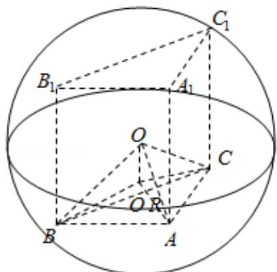

> [!faq]- 2009年全国统一高考数学试卷（理科）（全国卷ⅰ）（含解析版）解析
>
> > [!success]- **【答案】** 为： $20\pi$  【点评】本题是基础题, 解题思路是: 先求底面外接圆的半径, 转化为直角三角形, 求出球的半径，这是三棱柱外接球的常用方法；本题考查空间想象能力，计算 能力.
>
> > [!note]- **【分析】**
> > 通过正弦定理求出底面外接圆的半径，设此圆圆心为 $O'$ ，球心为 0，在
>
> > [!note]- **【解析】**
> > 分析】通过正弦定理求出底面外接圆的半径，设此圆圆心为 $O'$ ，球心为 0，在
> >
> > RT△OBO'中，求出球的半径，然后求出球的表面积.
> >
> > 【
> > 解答】解：在 $\triangle ABC$ 中 $AB=AC=2$ ， $\angle BAC=120^{\circ}$ ，
> >
> > 可得 $BC = 2\sqrt{3}$
> >
> > 由正弦定理，可得 $\triangle ABC$ 外接圆半径r=2，
> >
> > 设此圆圆心为 O'，球心为 O，在 RT△OBO' 中，
> >
> > 易得球半径 $R=\sqrt{5}$ ,
> >
> > 故此球的表面积为 $4\pi R^{2}=20\pi$
> >
> > 故
> > 答案为： $20\pi$
> >
> > 
> >
> > 【点评】本题是基础题, 解题思路是: 先求底面外接圆的半径, 转化为直角三角形,
> >
> > 求出球的半径，这是三棱柱外接球的常用方法；本题考查空间想象能力，计算
> >
> > 能力.
