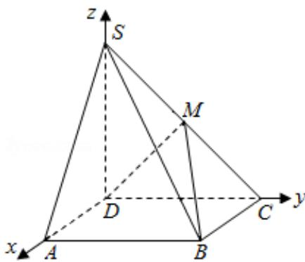

> [!faq]- 2009年全国统一高考数学试卷（理科）（全国卷ⅰ）（含解析版）解析
>
> > [!success]- **【答案】** 详见解析
>
> > [!note]- **【分析】**
> > （Ⅰ）法一：要证明 M 是侧棱 SC 的中点，作 MN∥SD 交 CD 于 N，作 NE⊥AB
>
> > [!note]- **【解析】**
> > 分析】（Ⅰ）法一：要证明 M 是侧棱 SC 的中点，作 MN∥SD 交 CD 于 N，作 NE⊥AB
> >
> > 交AB于E，连ME、NB，则MN⊥面ABCD，ME⊥AB，NE=AD= $\sqrt{2}$ 设MN=x，则
> >
> > NC=EB=x，解 RT△MNE 即可得 x 的值，进而得到 M 为侧棱 SC 的中点；
> >
> > 法二：分别以 DA、DC、DS 为 x、y、z 轴如图建立空间直角坐标系 D-xyz，并求出 S
> >
> > 点的坐标、C 点的坐标和 M 点的坐标，然后根据中点公式进行判断；
> >
> > 法三：分别以 DA、DC、DS 为 x、y、z 轴如图建立空间直角坐标系 D-xyz，构造空间
> >
> > 向量，然后数乘向量的方法来证明.
> >
> > （II）我们可以以 D 为坐标原点，分别以 DA、DC、DS 为 x、y、z 轴如图建立空间直角
> >
> > 坐标系 D - xyz，我们可以利用向量法求二面角 S - AM - B 的大小.
> >
> > 【
> > 解答】证明：（Ⅰ）作 MN∥SD 交 CD 于 N，作 NE⊥AB 交 AB 于 E，
> >
> > 连 ME、NB，则 MN⊥面 ABCD，ME⊥AB，NE=AD= $\sqrt{2}$
> >
> > 设 MN=x，则 NC=EB=x，
> >
> > 在 RT△MEB 中，∵∠MBE=60°∴ME= $\sqrt{3}$ x.
> >
> > 在 RT△MNE 中由 $ME^{2}=NE^{2}+MN^{2}:\cdot3x^{2}=x^{2}+2$
> >
> > 解得 x=1，从而 $MN=\frac{1}{2}SD$ ∴ M 为侧棱 SC 的中点 M.
> >
> > （Ⅰ）证法二：分别以 DA、DC、DS 为 x、y、z 轴如图建立空间直角坐标系 D-xyz，则
> >
> > A( $\sqrt{2}$ , 0, 0), B( $\sqrt{2}$ , 2, 0), C(0, 2, 0), S(0, 0, 2).
> >
> > 设 M (0, a, b) (a > 0, b > 0),
> >
> > 则 $\overrightarrow{BA} = (0, -2, 0), \overrightarrow{BM} = (-\sqrt{2}, a - 2, b), \overrightarrow{SM} = (0, a, b - 2), \overrightarrow{SC} = (0, 2, -2)$
> >
> > 由题得 $\left\{\begin{aligned}\cos<\overrightarrow{BABM}>\frac{1}{2},\\\overrightarrow{SM}\parallel\overrightarrow{SC}\end{aligned}\right.$
> >
> > $$
> > \text {即} \left\{ \begin{array}{l} \frac {- 2 (a - 2)}{2 \cdot \sqrt {(a - 2) ^ {2} + b ^ {2} + 2}} = \frac {1}{2} \\ - 2 a = 2 (b - 2) \end{array} \right.
> > $$
> >
> > 解之个方程组得 a=1，b=1 即 M（0，1，1）
> >
> > 所以 M 是侧棱 SC 的中点.
> >
> > 
