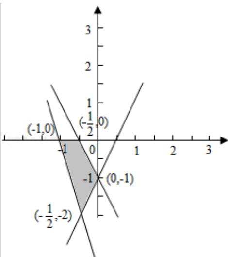

> [!faq]- 2009年全国统一高考数学试卷（理科）（全国卷ⅰ）（含解析版）解析
>
> > [!success]- **【答案】** 详见解析
>
> > [!note]- **【分析】**
> > （1）根据极值的意义可知，极值点 $x_{1}, x_{2}$ 是导函数等于零的两个根，根据
>
> > [!note]- **【解析】**
> > 解：（Ⅰ） $f'(x)=3x^{2}+6bx+3c$ ，（2分）
> >
> > 依题意知，方程 $f'(x)=0$ 有两个根 $x_{1}$ 、 $x_{2}$ ，且 $x_{1}\in[-1,0]$ ， $x_{2}\in[1,2]$
> >
> > 等价于 $f'(-1) \geqslant 0, f'(0) \leqslant 0, f'(1) \leqslant 0, f'(2) \geqslant 0.$
> >
> > 由此得 b，c 满足的约束条件为 $\left\{\begin{aligned}c&\geqslant2b-1\\ c&\leqslant0\\ c&\leqslant-2b-1\\ c&\geqslant-4b-4\end{aligned}\right.$ (4 分)
> >
> > 满足这些条件的点（b，c）的区域为图中阴影部分。（6分）
> >
> > （II）由题设知 $f'(x_{2})=3x_{2}^{2}+6bx_{2}+3c=0$
> >
> > 则 $b x_{2} = -\frac{1}{2} x_{2}^{2} - \frac{1}{2} c$ ,
> >
> > 故 $f(x_{2})=x_{2}^{3}+3bx_{2}^{2}+3cx_{2}=\frac{1}{2}x_{2}^{3}+\frac{3c}{2}x_{2}.$
> >
> > 由于 $x_{2}\in[1,2]$ ，而由（Ⅰ）知 $c\leq0$ ，
> >
> > 故 $-4 + 3c \leqslant f(x_2) \leqslant \frac{1}{2} + \frac{3}{2}c.$
> >
> > 又由（Ⅰ）知 $-2 \leq c \leq 0$ ，（10 分）
> >
> > 所以 $-10 \leqslant f(x_2) \leqslant -\frac{1}{2}$ .
> >
> > 
> >
> > 【点评】本题主要考查了利用导数研究函数的极值，以及二元一次不等式（组）与
> >
> > 平面区域和不等式的证明，属于基础题.
