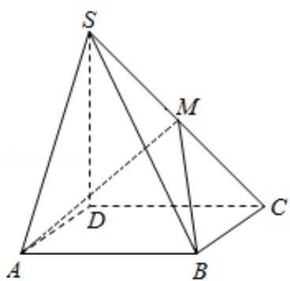

<!-- question-source:start -->
18. (12 分) 如图, 四棱锥 S-ABCD 中, 底面 ABCD 为矩形, SD⊥底面 ABCD, AD= $\sqrt{2}$

，DC=SD=2，点M在侧棱SC上， $\angle ABM=60^{\circ}$

(I) 证明：M 是侧棱 SC 的中点；

（II）求二面角 S - AM - B 的大小.

<!-- question-source:end -->

![[高中/真题/按年份分类/2009/2009年全国统一高考数学试卷_理科__全国卷ⅰ__含解析版_/解答题/题目/answers/Q00024518A1.md]]
