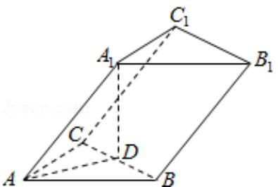

<!-- question-source:start -->
7. (5 分) 已知三棱柱 $ABC - A_{1}B_{1}C_{1}$ 的侧棱与底面边长都相等, $A_{1}$ 在底面 $ABC$ 上的射影 $D$ 为 $BC$ 的中点, 则异面直线 $AB$ 与 $CC_{1}$ 所成的角的余弦值为 ( )

A. $\frac{\sqrt{3}}{4}$ B. $\frac{\sqrt{5}}{4}$ C. $\frac{\sqrt{7}}{4}$ D. $\frac{3}{4}$

【考点】LO：空间中直线与直线之间的位置关系.

【
<!-- question-source:end -->

![[高中/真题/按年份分类/2009/2009年全国统一高考数学试卷_理科__全国卷ⅰ__含解析版_/选择题/题目/answers/Q00027863A1.md]]
