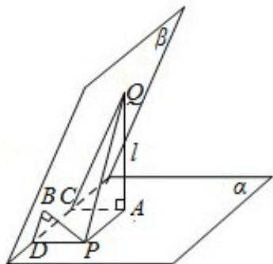

<!-- question-source:start -->
10.（5分）已知二面角 $\alpha-1-\beta$ 为 $60^{\circ}$ ，动点 P、Q 分别在面 $\alpha$ 、 $\beta$ 内，P 到 $\beta$ 的距离

为 $\sqrt{3}$ ，Q到 $\alpha$ 的距离为 $2\sqrt{3}$ ，则P、Q两点之间距离的最小值为（）

A. 1 B. 2 C. $2\sqrt{3}$ D. 4

【考点】LQ：平面与平面之间的位置关系.

【专题】11：计算题；16：压轴题.

【
<!-- question-source:end -->

![[高中/真题/按年份分类/2009/2009年全国统一高考数学试卷_理科__全国卷ⅰ__含解析版_/选择题/题目/answers/Q00027866A1.md]]
