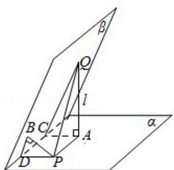

> [!faq]- 2009年全国统一高考数学试卷（理科）（全国卷ⅰ）（含解析版）解析
>
> > [!success]- **【答案】** C
>
> > [!note]- **【分析】**
> > 分别作 $QA \perp \alpha$ 于 A，AC $\perp$ I 于 C，PB $\perp \beta$ 于 B，PD $\perp$ I 于 D，连 CQ，BD 则
>
> > [!note]- **【解析】**
> > 解：如图
> >
> > 分别作 $QA \perp \alpha$ 于 A，AC⊥I 于 C，PB⊥β 于 B，PD⊥I 于 D，
> >
> > 连 CQ，BD 则 $\angle ACQ = \angle PDB = 60^{\circ}$ ，AQ = 2√3，BP = √3，
> >
> > 又∵ $PQ=\sqrt{AQ^{2}+AP^{2}}=\sqrt{12+AP^{2}}\geqslant2\sqrt{3}$
> >
> > 当且仅当 AP=0，即点 A 与点 P 重合时取最小值。
> >
> > 故选：C.
> >
> > 
