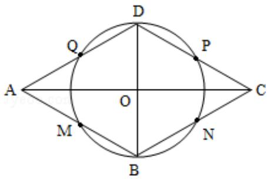

> [!faq]- 2009年全国统一高考数学试卷（理科）（全国卷ⅱ）（含解析版）解析
>
> > [!success]- **【答案】** 详见解析
>
> > [!note]- **【分析】**
> > 如图，菱形ABCD的对角线AC和BD相交于点O，菱形ABCD各边中点分
>
> > [!note]- **【解析】**
> > 分析】如图，菱形ABCD的对角线AC和BD相交于点O，菱形ABCD各边中点分
> >
> > 别为 M、N、P、Q，根据菱形的性质得到 AC⊥BD，垂足为 O，且 AB=BC=CD=DA，
> >
> > 再根据直角三角形斜边上的中线等于斜边的一半得到 OM=ON=OP=OQ= $\frac{1}{2}$ AB，
> >
> > 得到 M、N、P、Q 四点在以 O 为圆心 OM 为半径的圆上.
> >
> > 【
> > 解答】已知：如图，菱形ABCD的对角线AC和BD相交于点O.
> >
> > 求证：菱形ABCD各边中点M、N、P、Q在以O为圆心的同一个圆上.
> >
> > 证明：∵四边形 ABCD 是菱形，
> >
> > ∴AC⊥BD，垂足为O，且AB=BC=CD=DA，
> >
> > 而 M、N、P、Q 分别是边 AB、BC、CD、DA 的中点，
> >
> > $$
> > \therefore O M = O N = O P = O Q = \frac {1}{2} A B,
> > $$
> >
> > ∴M、N、P、Q四点在以O为圆心OM为半径的圆上.
> >
> > 所以菱形各边中点在以对角线的交点为圆心的同一个圆上.
> >
> > 
> >
> > 【点评】本题考查了四点共圆的判定方法。也考查了菱形的性质以及直角三角形斜边上的中线等于斜边的一半。
> >
> > ## 三、解答题（共6小题，满分70分）
