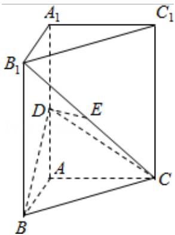

<!-- question-source:start -->
18. (12 分) 如图, 直三棱柱 $ABC - A_{1}B_{1}C_{1}$ 中, $AB \perp AC$ , D、E 分别为 $AA_{1}, B_{1}C$ 的中点

DE⊥平面 BCC $_{1}$ .

（Ⅰ）证明：AB=AC；

（II）设二面角 A-BD-C 为 $60^{\circ}$ ，求 $B_{1}C$ 与平面 BCD 所成的角的大小.

<!-- question-source:end -->

![[高中/真题/按年份分类/2009/2009年全国统一高考数学试卷_理科__全国卷ⅱ__含解析版_/解答题/题目/answers/Q00025342A1.md]]
