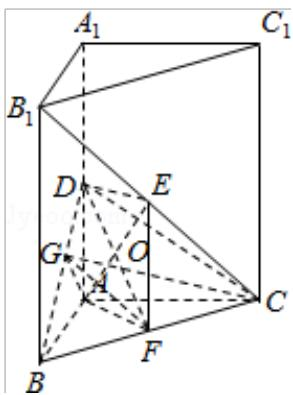

> [!faq]- 2009年全国统一高考数学试卷（理科）（全国卷ⅱ）（含解析版）解析
>
> > [!success]- **【答案】** 详见解析
>
> > [!note]- **【分析】**
> > （1）连接 BE，可根据射影相等的两条斜线段相等证得 BD=DC，再根据相
>
> > [!note]- **【解析】**
> > 分析】（1）连接 BE，可根据射影相等的两条斜线段相等证得 BD=DC，再根据相
> >
> > 等的斜线段的射影相等得到 AB=AC;
> >
> > (2) 求 $\mathrm{B}_{1} \mathrm{C}$ 与平面 BCD 所成的线面角，只需求点 $\mathrm{B}_{1}$ 到面 BDC 的距离即可，作
> >
> > AG⊥BD 于 G，连 GC，∠AGC 为二面角 A-BD-C 的平面角，在三角形 AGC 中
> >
> > 求出 GC 即可.
> >
> > 【
> > 解答】解：如图
> >
> > (I) 连接 BE，∵ ABC - A₁B₁C₁ 为直三棱柱，
> >
> > $\therefore \angle B_{1}BC = 90^{\circ},$
> >
> > ∵E为 $B_{1}C$ 的中点，∴BE=EC.
> >
> > 又 DE⊥平面 BCC $_{1}$ ,
> >
> > ∴BD=DC（射影相等的两条斜线段相等）而 DA⊥平面 ABC，
> >
> > ∴AB=AC（相等的斜线段的射影相等）.
> >
> > (Ⅱ) 求 $B_{1}C$ 与平面 BCD 所成的线面角，
> >
> > 只需求点 $B_{1}$ 到面 BDC 的距离即可.
> >
> > 作 AG⊥BD 于 G，连 GC，
> >
> > ∵AB⊥AC，∴GC⊥BD，
> >
> > ∠AGC 为二面角 A - BD - C 的平面角， $\angle AGC = 60^{\circ}$
> >
> > 不妨设 $AC=2\sqrt{3}$ ，则AG=2，GC=4
> >
> > 在RT△ABD中，由AD●AB=BD●AG，易得 $AD=\sqrt{6}$
> >
> > 设点 $B_{1}$ 到面 BDC 的距离为 h， $B_{1}C$ 与平面 BCD 所成的角为 $\alpha$ .
> >
> > 利用 $\frac{1}{3}S_{\triangle B_{1}BC}\cdot DE=\frac{1}{3}S_{\triangle BCD}\cdot h,$
> >
> > 可求得 $h = 2\sqrt{3}$ ，又可求得 $B_{1}C = 4\sqrt{3}\sin \alpha = \frac{h}{B_{1}C} = \frac{1}{2}$ ， $\therefore \alpha = 30^{\circ}$ 。
> >
> > 即 $B_{1}C$ 与平面 BCD 所成的角为 $30^{\circ}$ .
> >
> > 
> >
> > 【点评】本题主要考查了平面与平面之间的位置关系,考查空间想象能力、运算能
> >
> > 力和推理论证能力，属于基础题.
