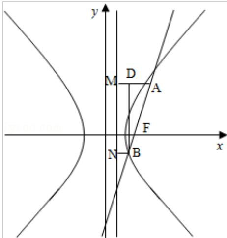

<!-- question-source:start -->
11.（5分）已知双曲线C: $\frac{x^2}{a^2} \frac{y^2}{b^2} = 1 (a > 0, b > 0)$ 的右焦点为F，过F且斜率为 $\sqrt{3}$ 的直线交C于A、B两点，若 $\overrightarrow{AF} = 4\overrightarrow{FB}$ ，则C的离心率为（）

A. $\frac{6}{5}$ B. $\frac{7}{5}$ C. $\frac{5}{8}$ D. $\frac{9}{5}$
<!-- question-source:end -->

![[高中/真题/按年份分类/2009/2009年全国统一高考数学试卷_理科__全国卷ⅱ__含解析版_/选择题/题目/answers/Q00025335A1.md]]
