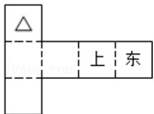

<!-- question-source:start -->
12. (5 分) 纸制的正方体的六个面根据其方位分别标记为上、下、东、南、西、北.
现在沿该正方体的一些棱将正方体剪开、外面朝上展平，得到如图所示的平面图形，则标“△”的面的方位（）

A. 南 B. 北 C. 西 D. 下

##
<!-- question-source:end -->

![[高中/真题/按年份分类/2009/2009年全国统一高考数学试卷_理科__全国卷ⅱ__含解析版_/选择题/题目/answers/Q00027872A1.md]]
