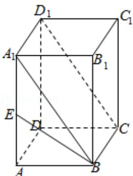

> [!faq]- 2009年全国统一高考数学试卷（理科）（全国卷ⅱ）（含解析版）解析
>
> > [!success]- **【答案】** C
>
> > [!note]- **【分析】**
> > 由 $BA_{1}\parallel CD_{1}$ ，知 $\angle A_{1}BE$ 是异面直线 BE 与 $CD_{1}$ 所形成角，由此能求出异面直线 BE 与 $CD_{1}$ 所形成角的余弦值.
>
> > [!note]- **【解析】**
> > 解：∵正四棱柱 $ABCD-A_{1}B_{1}C_{1}D_{1}$ 中， $AA_{1}=2AB$ ，E 为 $AA_{1}$ 中点，
> >
> > ∴ $BA_{1}\parallel CD_{1}$ ，∴∠ $A_{1}BE$ 是异面直线 BE 与 $CD_{1}$ 所形成角，
> >
> > 设 $AA_{1}=2AB=2$ ，
> >
> > 则 $A_{1}E=1$ ， $BE=\sqrt{1^{2}+1^{2}}=\sqrt{2}$ ， $A_{1}B=\sqrt{1^{2}+2^{2}}=\sqrt{5}$ ，
> >
> > ∴ $\cos\angle A_{1}BE=\frac{A_{1}B^{2}+BE^{2}-A_{1}E^{2}}{2\cdot A_{1}B\cdot BE}$ $=\frac{5+2-1}{2\times\sqrt{5}\times\sqrt{2}}$
> >
> > $$
> > = \frac {3 \sqrt {1 0}}{1 0}.
> > $$
> >
> > ∴异面直线 BE 与 CD₁ 所形成角的余弦值为 $\frac{3\sqrt{10}}{10}$ .
> >
> > 故选：C.
> >
> > 
> >
> > 【点评】本题考查异面直线所成角的余弦值的求法, 是基础题, 解题时要认真审题,
> > 注意空间思维能力的培养.
