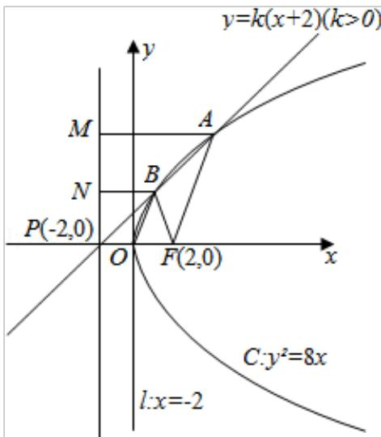

> [!faq]- 2009年全国统一高考数学试卷（理科）（全国卷ⅱ）（含解析版）解析
>
> > [!success]- **【答案】** D
>
> > [!note]- **【分析】**
> > 根据直线方程可知直线恒过定点，如图过A、B分别作AM⊥I于M，BN⊥I
>
> > [!note]- **【解析】**
> > 解：设抛物线 C: $y^{2}=8x$ 的准线为 I: x=-2
> >
> > 直线 $y=k(x+2)$ （k>0）恒过定点 P（-2，0）
> >
> > 如图过 A、B 分别作 AM⊥I 于 M，BN⊥I 于 N，
> >
> > 由 $|FA|=2|FB|$ ，则 $|AM|=2|BN|$ ，
> >
> > 点 B 为 AP 的中点、连接 OB，
> >
> > 则 $\left|OB\right|=\frac{1}{2}\left|AF\right|$ ,
> >
> > $\therefore |OB|=|BF|$ ，点 B 的横坐标为 1，
> >
> > 故点 B 的坐标为 $(1, 2\sqrt{2})$ $\therefore k=\frac{2\sqrt{2}-0}{1-(-2)}=\frac{2\sqrt{2}}{3}$ ,
> >
> > 故选：D.
> >
> > 
> >
> > 【点评】本题主要考查了抛物线的简单性质。考查了对抛物线的基础知识的灵活运用。
