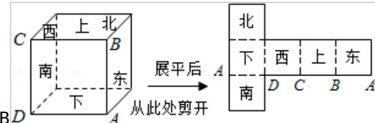

> [!faq]- 2009年全国统一高考数学试卷（理科）（全国卷ⅱ）（含解析版）解析
>
> > [!success]- **【答案】** 详见解析
>
> > [!note]- **【分析】**
> > 本题考查多面体展开图；正方体的展开图有多种形式，结合题目，首先满
>
> > [!note]- **【解析】**
> > 分析】本题考查多面体展开图；正方体的展开图有多种形式，结合题目，首先满
> >
> > 足上和东所在正方体的方位，“△”的面就好确定.
> >
> > 【
> > 解答】解：如图所示.
> >
> > 
> >
> > 【点评】本题主要考查多面体的展开图的复原，属于基本知识基本能力的考查.
> >
> > ## 二、填空题（共4小题，每小题5分，满分20分）
