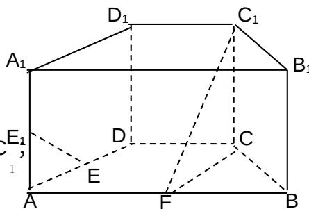

<!-- question-source:start -->
17.(本小题满分 12 分)设函数 $f(x)=2\sin x\cos^{2}\frac{\varphi}{2}+\cos x\sin\varphi-\sin x(0<\varphi<\pi)$ 在 $\chi=\pi$ 处取最小值.

(1) 求 $\varphi$ 的值;

(2) 在 $\Delta ABC$ 中, a, b, c 分别是角 A, B, C 的对边, 已知 $a = 1, b = \sqrt{2}$ , $f(A) = \frac{\sqrt{3}}{2}$ , 求角 C.

## 18. (本小题满分 12 分)

如图，在直四棱柱 ABCD-A B C D 中，底面 ABCD 为等腰梯形，AB//CD，AB=4，BC=CD=2，AA=2，

E、E 分别是棱 AD、AA 的中点
1
1

(Ⅰ) 设 F 是棱 AB 的中点, 证明: 直线 EE // 平面 FCC

（II）证明:平面 $D_{1}AC \perp$ 平面 $BB_{1}C_{1}C$ .
<!-- question-source:end -->

![[高中/真题/按年份分类/2009/2009年山东高考数学文科试题及答案/解答题/题目/answers/Q00026227A1.md]]
