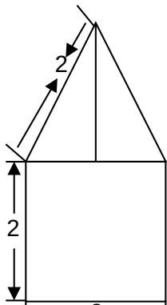
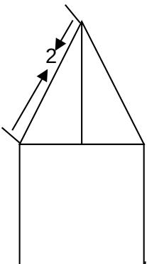
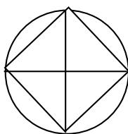

<!-- question-source:start -->
4. 一空间几何体的三视图如图所示,则该几何体的体积为( ). A. $2\pi + 2\sqrt{3}$ B. $\frac{4\pi + 3\sqrt{3}}{3}$ C. $\frac{2\pi + \frac{2\sqrt{3}}{3}}{3}$ D. $\frac{4\pi + \frac{2\sqrt{3}}{3}}{3}$

  
俯视图
<!-- question-source:end -->

![[高中/真题/按年份分类/2009/2009年山东高考数学文科试题及答案/选择题/题目/answers/Q00026214A1.md]]
