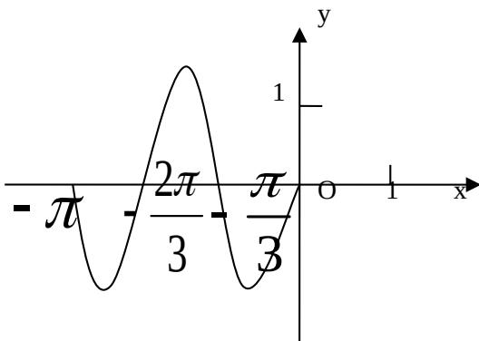

<!-- question-source:start -->
4. 函数 $y = A \sin (\omega x + \varphi) (A, \omega, \varphi$ 为常数， $A > 0, \omega > 0)$ 在闭区间 $[-\pi, 0]$ 上的图象如图所示，则 $\omega =$ \_\_\_\_ .

<!-- question-source:end -->

![[高中/真题/按年份分类/2009/2009年江苏高考数学试卷及答案/填空题/题目/answers/Q00026749A1.md]]
