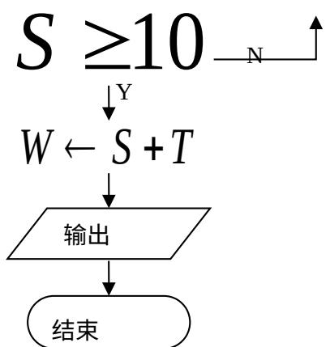

<!-- question-source:start -->
9.在平面直角坐标系 $xoy$ 中，点P在曲线 $C:y = x^{3} - 10x + 3$ 上，

且在第二象限内，已知曲线 C 在点 P 处的切线的斜率为 2，则点 P 的坐标为 \_\_\_\_.
<!-- question-source:end -->

![[高中/真题/按年份分类/2009/2009年江苏高考数学试卷及答案/填空题/题目/answers/Q00026754A1.md]]
