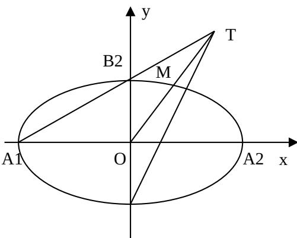

<!-- question-source:start -->
13. 如图，在平面直角坐标系 $xoy$ 中， $A_{1}, A_{2}, B_{1}, B_{2}$ 为椭圆 $\frac{x^{2}}{a^{2}} + \frac{y^{2}}{b^{2}} = 1 (a > b > 0)$ 的四个顶点， $F$ 为其右焦点，直线 $A_{1}B_{2}$ 与直线 $B_{1}F$ 相交于点 T，线段 $OT$ 与椭圆的交点 $M$ 恰为线段 $OT$ 的中点，则该椭圆的离心率为 \_\_\_\_.

<!-- question-source:end -->

![[高中/真题/按年份分类/2009/2009年江苏高考数学试卷及答案/填空题/题目/answers/Q00026758A1.md]]
