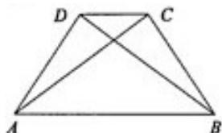

<!-- question-source:start -->
21. 参考公式： $1^{2}+2^{2}+3^{2}+\cdots+n^{2}=\frac{n(n+1)(2n+1)}{6}.$

21.[选做题]在 A、B、C、D 四小题中只能选做两题, 每小题 10 分, 共计 20 分。请在答题卡指定区域内作答, 解答时应写出文字说明、证明过程或演算步骤。

A.选修4-1：几何证明选讲

如图，在四边形 ABCD 中， $\triangle ABC \cong \triangle BAD.$

求证：AB∥CD.

<!-- question-source:end -->

![[高中/真题/按年份分类/2009/2009年江苏高考数学试卷及答案/填空题/题目/answers/Q00030657A1.md]]
