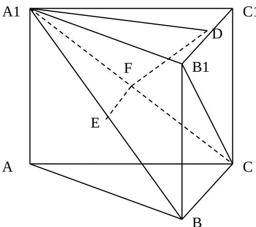

> [!faq]- 2009年江苏高考数学试卷及答案解析
>
> > [!success]- **【答案】** 详见解析
>
> > [!note]- **【分析】**
> > 本题未单列分析。
>
> > [!note]- **【解析】**
> > 以 $a_4 + a_3 = 0$ ，即 $2a_{1} + 5d = 0$ ，又由 $S_{7} = 7$ 得 $7a_{1} + \frac{7\times 6}{2} d = 7$ ，解得 $a_1 = -5$ ， $d = 2$ 所以 $\left\{a_n\right\}$ 的通项公式为 $a_{n} = 2n - 7$ ，前 $n$ 项和 $S_{n} = n^{2} - 6n$ 。
> >
> > 
> > (2) $\frac{a_m a_{m+1}}{a_{m+2}} = \frac{(2m - 7)(2m - 5)}{(2m - 3)}$ ，令 $2m - 3 = t$ ， $\frac{a_m a_{m+1}}{a_{m+2}} = \frac{(t - 4)(t - 2)}{t} = t + \frac{8}{t} - 6$
> >
> > 因为 $t$ 是奇数，所以 $t$ 可取的值为 $\pm 1$ ，当 $t = 1$ ， $m = 2$ 时， $t + \frac{8}{t} - 6 = 3$ ， $2 \times 5 - 7 = 3$ ，是数列 $\left\{a_{n}\right\}$ 中的项； $t = -1$ ， $m = 1$ 时， $t + \frac{8}{t} - 6 = -15$ ，数列 $\left\{a_{n}\right\}$ 中的最小项是-5，不符合。
> >
> > 所以满足条件的正整数 $m = 2$ 。
