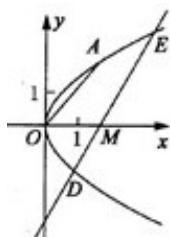

> [!faq]- 2009年江苏高考数学试卷及答案解析
>
> > [!success]- **【答案】** 详见解析
>
> > [!note]- **【分析】**
> > 本题未单列分析。
>
> > [!note]- **【解析】**
> > [必做题]本小题主要考查直线、抛物线及两点间的距离公式等基本知识，考查运算求解能力。满分10分。
> >
> > 解:
> > (1)由题意,可设抛物线 C 的标准方程为 $y^{2}=2px$ . 因为点 A(2,2) 在抛物线 C 上, 所以 p=1. 因此, 抛物线 C 的标准方程为 $y^{2}=2x$ .
> > (2) 由
> > (1) 可得焦点 F 的坐标是 $\left(\frac{1}{2},0\right)$ ，又直线 OA 的斜率为 $\frac{2}{2}=1$ ，故与直线 OA 垂直的直线的斜率为 -1。因此，所求直线的方程是 $x+y-\frac{1}{2}=0$ 。
> >
> > 
> > (3) 解法一：
> >
> > 设点 $D$ 和 $E$ 的坐标分别为 $(x_{1},y_{1})$ 和 $(x_{2},y_{2})$ ，直线 $DE$ 的方程是 $y = k(x - m)$ $k\neq 0.$ 将 $x = \frac{y}{k} +m$ 代入 $y^{2} = 2x$ ，有 $ky^{2} - 2y - 2km = 0,$ 解得 $y_{1,2} = \frac{1\pm\sqrt{1 + 2mk^2}}{k}.$ 由 $ME = 2DM$ 知 $1 + \sqrt{1 + 2mk^2} = 2(\sqrt{1 + 2mk^2} -1)$ ，化简得 $k^2 = \frac{4}{m}$ 因此
> >
> > $$
> > \begin{array}{r l} D E ^ {2} & = (x _ {1} - x _ {2}) ^ {2} + (y _ {1} - y _ {2}) ^ {2} = (1 + \frac {1}{k ^ {2}}) (y _ {1} - y _ {2}) ^ {2} \\ & = \left(1 + \frac {1}{k ^ {2}}\right) \frac {4 (1 + 2 m k ^ {2})}{k ^ {2}} = \frac {9}{4} (m ^ {2} + 4 m). \end{array}
> > $$
> >
> > 所以 $f(m)=\frac{3}{2}\sqrt{m^{2}+4m}(m>0)$ .
> >
> > 解法二：
> >
> > 设 $D\left(\frac{s^2}{2},s\right),E\left(\frac{t^2}{2},t\right).$ 由点 $M(m,0)$ 及 $\overrightarrow{ME} = 2\overrightarrow{DM}$ 得
> >
> > $$
> > \frac {1}{2} t ^ {2} - m = 2 \left(m - \frac {s ^ {2}}{2}\right), t - 0 = 2 (0 - s).
> > $$
> >
> > 因此 $t = -2s, m = s^2$ . 所以
> >
> > $$
> > f (m) = D E = \sqrt {\left(2 s ^ {2} - \frac {s ^ {2}}{2}\right) ^ {2} + (- 2 s - s) ^ {2}} = \frac {3}{2} \sqrt {m ^ {2} + 4 m} (m > 0).
> > $$
