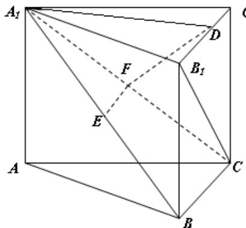

<!-- question-source:start -->
16. （本小题满分 14 分）
如图，在直三棱柱 $ABC - A_{1}B_{1}C_{1}$ 中， $E, F$ 分别是 $A_{1}B, A_{1}C$ 的中点，点 $D$ 在 $B_{1}C_{1}$ 上， $A_{1}D \perp B_{1}C$

求证：(1) $EF \parallel$ 平面ABC (2) 平面 $A_{1}FD \perp$ 平面 $BB_{1}C_{1}C$
<!-- question-source:end -->

![[高中/真题/按年份分类/2009/2009年江苏高考数学试卷及答案/解答题/题目/answers/Q00026761A1.md]]
