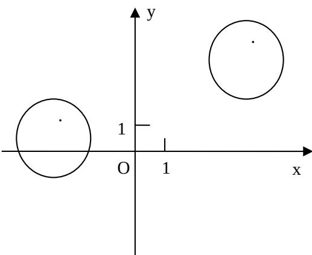

<!-- question-source:start -->
17．（本小题满分14分）设 $\left\{a_{n}\right\}$ 是公差不为零的等差数列， $S_{n}$ 为其前n项和，满足 $a_{2}^{2}+a_{3}^{2}=a_{4}^{2}+a_{5}^{2},S_{7}=7$ (1)求数列 $\left\{a_{n}\right\}$ 的通项公式及前n项和 $S_{n}$ ;(2)试求所有的正整数m，使得 $\frac{a_{m}a_{m+1}}{a_{m+2}}$ 为数列 $\left\{a_{n}\right\}$ 中的项.

## 18. （本小题满分 16 分）

在平面直角坐标系 $xoy$ 中，已知圆 $C_1:(x + 3)^2 +(y - 1)^2 = 4$ 和圆 $C_2:(x - 4)^2 +(y - 5)^2 = 4$ (1)若直线 $l$ 过点 $A(4,0)$ ，且被圆 $C_1$ 截得的弦长为 $2\sqrt{3}$ ，求直线 $l$ 的方程；(2）设 $\mathbb{P}$ 为平面上的点，满足：存在过点 $\mathbb{P}$ 的无穷多对互相垂的直线 $l_{1}$ 和 $l_{2}$ ，它们分别与圆 $C_1$ 和圆 $\mathrm{C}_{2}$ 相交，且直线 $l_{1}$ 被圆 $C_1$ 截得的弦长与直线 $l_{2}$ 被圆 $\mathrm{C}_2$ 截得的弦长相等，试求所有满足条件的点 $\mathbb{P}$ 的坐标.

<!-- question-source:end -->

![[高中/真题/按年份分类/2009/2009年江苏高考数学试卷及答案/解答题/题目/answers/Q00026762A1.md]]
