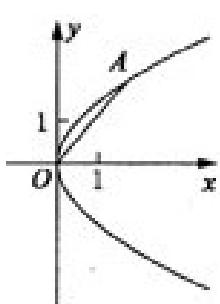

<!-- question-source:start -->
## 22. (本题满分 10 分)

在平面直角坐标系 $xoy$ 中，抛物线C的顶点在原点，经过点A（2，2），其焦点F轴上。

(1) 求抛物线 C 的标准方程;

(2) 求过点 F，且与直线 OA 垂直的直线的方程；

<!-- question-source:end -->

![[高中/真题/按年份分类/2009/2009年江苏高考数学试卷及答案/解答题/题目/answers/Q00031254A1.md]]
