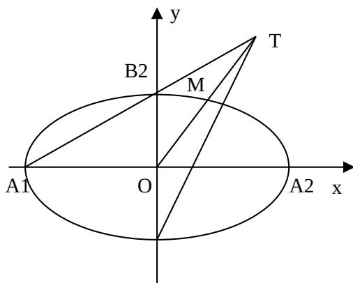

> [!faq]- 2009年江苏高考数学试卷及答案解析
>
> > [!success]- **【答案】** 详见解析
>
> > [!note]- **【分析】**
> > 本题未单列分析。
>
> > [!note]- **【解析】**
> > 由 $a$ 与 $b - 2c$ 垂直， $a \cdot (b - 2c) = a \cdot b - 2a \cdot c = 0$
> >
> > 
> >
> > 即 $4\sin (\alpha +\beta) - 8\cos (\alpha +\beta) = 0$ ， $\tan (\alpha +\beta) = 2$
> >
> > $$
> > \boldsymbol {b} + \boldsymbol {c} = (\sin \beta + \cos \beta , 4 \cos \beta - 4 \sin \beta)
> > $$
> >
> > $$
> > \left| \boldsymbol {b} + \boldsymbol {c} \right| ^ {2} = \sin^ {2} \beta + 2 \sin \beta \cos \beta + \cos^ {2} \beta + 1 6 \cos^ {2} \beta - 3 2 \cos \beta \sin \beta + 1 6 \sin^ {2} \beta
> > $$
> >
> > $= 17 - 30\sin \beta \cos \beta = 17 - 15\sin 2\beta$ ，最大值为32，所以 $|\pmb {b} + \pmb{c}|_{\text{的最大值为}}4\sqrt{2}$ 。
> >
> > $$
> > \tan \alpha \tan \beta = 1 6 _ {\text {得}} \sin \alpha \sin \beta = 1 6 \cos \alpha \cos \beta
> > $$
> >
> > $$
> > 4 \cos \alpha \cdot 4 \cos \beta - \sin \alpha \sin \beta = 0
> > $$
> >
> > 所以 $a \parallel b$ .
