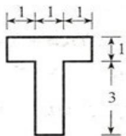
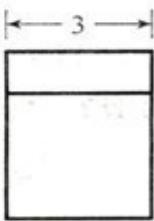
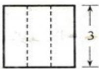

<!-- question-source:start -->
12. (2009 浙江理 12) 若某几何体的三视图 (单位: $cm$ ) 如图所示, 则此几何体的体积是 $\_ cm^3$

  
正视图

  
侧视图  
俯视图
<!-- question-source:end -->

![[高中/真题/按年份分类/2009/2009年浙江高考数学_理科_试卷_含答案_/填空题/题目/answers/Q00022518A1.md]]
