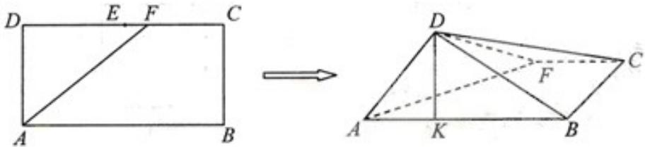

<!-- question-source:start -->
17. (2009 浙江理 17) 如图, 在长方形 $ABCD$ 中, $AB = 2$ , $BC = 1$ , $E$ 为 $DC$ 的中点, $F$ 为线段

EC（端点除外）上一动点.现将 $\Delta AFD$ 沿 AF 折起，使平面 $ABD \perp$ 平面 ABC.在平面 ABD 内过点 D 作 $DK \perp AB$ ，K 为垂足.设 AK = t，则 t 的取值范围是 \_\_\_\_.

  
(第17题)

##
<!-- question-source:end -->

![[高中/真题/按年份分类/2009/2009年浙江高考数学_理科_试卷_含答案_/填空题/题目/answers/Q00027894A1.md]]
