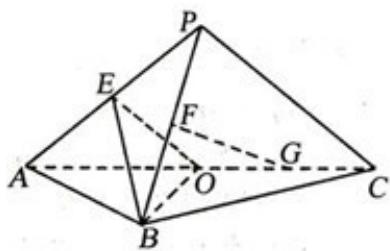

<!-- question-source:start -->
20. (2009 浙江理 20) 如图, 平面 $PAC \perp$ 平面 $ABC$ , $\Delta ABC$ 是以 $AC$ 为斜边的等腰直角三角形, $E, F, O$ 分别为 $PA$ , $PB$ , $AC$ 的中点, $AC = 16$ , $PA = PC = 10$ .

(Ⅰ) 设 G 是 OC 的中点，证明： $FG \parallel$ 平面 BOE；

(Ⅱ) 证明：在 $\Delta ABO$ 内存在一点 $M$ ，使 $FM \perp$ 平面 $BOE$ ，并求点 $M$ 到 $OA$ ， $OB$ 的距离.

<!-- question-source:end -->

![[高中/真题/按年份分类/2009/2009年浙江高考数学_理科_试卷_含答案_/解答题/题目/answers/Q00022526A1.md]]
