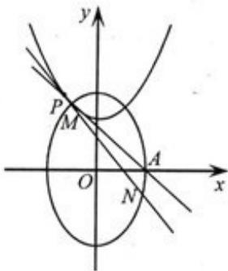

<!-- question-source:start -->
21. (2009 浙江理 21) 已知椭圆 $C_{1}: \frac{y^{2}}{a^{2}} + \frac{x^{2}}{b^{2}} = 1 (a > b > 0)$ 的右顶点为 $A(1,0)$ ，过 $C_{1}$ 的焦点且垂直长轴的弦长为 1。

(Ⅰ) 求椭圆 $C_{1}$ 的方程；

(Ⅱ) 设点 P 在抛物线 $C_{2}$ ： $y = x^{2} + h (h \in \mathbb{R})$ 上， $C_{2}$ 在点 P 处的切线与 $C_{1}$ 交于点 M, N 当线段 AP 的中点与 MN 的中点的横坐标相等时，求 h 的最小值。

<!-- question-source:end -->

![[高中/真题/按年份分类/2009/2009年浙江高考数学_理科_试卷_含答案_/解答题/题目/answers/Q00022527A1.md]]
