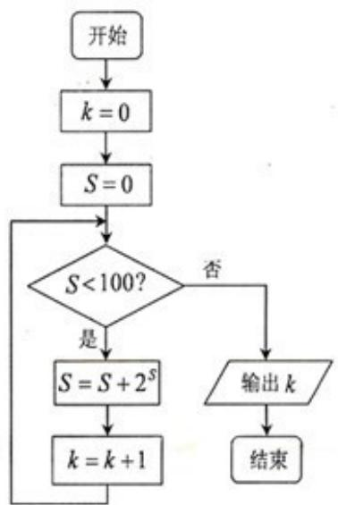

<!-- question-source:start -->
6. （2009 浙江理 6）某程序框图如图所示，该程序运行后输出的 $k$ 的值是（）

A. $4$ B. $5$ C. $6$ D. $7$
<!-- question-source:end -->

![[高中/真题/按年份分类/2009/2009年浙江高考数学_理科_试卷_含答案_/选择题/题目/answers/Q00022512A1.md]]
