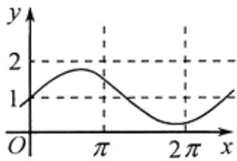
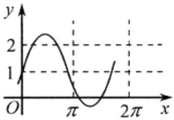
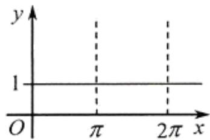
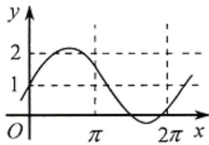

<!-- question-source:start -->
8. (2009 浙江理 8) 已知 $a$ 是实数, 则函数 $f(x) = 1 + a \sin ax$ 的图象不可能是( )

A.

B.

C.

  
D.
<!-- question-source:end -->

![[高中/真题/按年份分类/2009/2009年浙江高考数学_理科_试卷_含答案_/选择题/题目/answers/Q00022514A1.md]]
