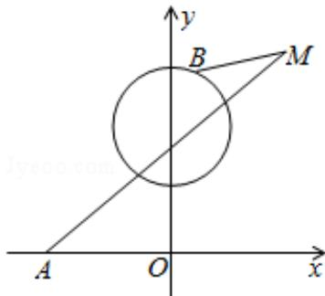

<!-- question-source:start -->
20.（12分）（2009·重庆）已知以原点O为中心的双曲线的一条准线方程为 $x = \frac{\sqrt{5}}{5}$ ，离心率 $e = \sqrt{5}$ .

（Ⅰ）求该双曲线的方程；

（II）如图，点A的坐标为 $(- \sqrt{5}, 0)$ ，B是圆 $x^{2} + (y - \sqrt{5})^{2} = 1$ 上的点，点M在双曲线右支上， $|\mathrm{MA}| + |\mathrm{MB}|$ 的最小值，并求此时M点的坐标.

<!-- question-source:end -->

![[高中/真题/按年份分类/2009/2009年重庆市高考数学试卷_文科_含答案/填空题/题目/answers/Q00022924A1.md]]
