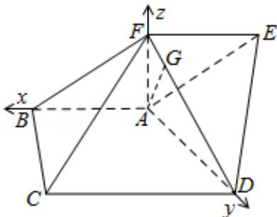

> [!faq]- 2009年重庆市高考数学试卷(文科)含答案解析
>
> > [!success]- **【答案】** 详见解析
>
> > [!note]- **【分析】**
> > 解法一：（几何法）（Ⅰ）AB 到面 EFCD 的距离等于点 A 到面 EFCD 的距离，故可过 A 作平面 EFCD 的垂线，注意到面 AFD⊥面 EFDC，故只需过 A 作 FD 的垂线即可.
>
> > [!note]- **【解析】**
> > 分析】解法一：（几何法）（Ⅰ）AB 到面 EFCD 的距离等于点 A 到面 EFCD 的距离，故可过 A 作平面 EFCD 的垂线，注意到面 AFD⊥面 EFDC，故只需过 A 作 FD 的垂线即可.
> >
> > （Ⅱ）由已知条件做出二面角 F-AD-E 的平面角，再求解．已知 FA⊥AD，再可求证 EA⊥AD，故，∠FAE 为二面角 F-AD-E 的平面角，再解△AEF 即可.
> > 解法二：（向量法）由 AB、AD、AF 两两垂直，故可通过向量法求解.
> >
> > （Ⅰ）求平面 EFCD 的法向量 $\vec{\pi}$ ，则直线 AB 到平面 EFCD 的距离 $=\frac{\overrightarrow{PA}\cdot\overrightarrow{\pi}}{|\overrightarrow{m}|}$
> >
> > （II）分别求出两个面的法向量，再求两个法向量的余弦，即二面角F-AD-E的平面角的余弦，再求正切即可.
> >
> > 【
> > 解答】解：法一：
> >
> > (Ⅰ) $\because AB\|DC, DC\subset$ 平面 EFCD,
> >
> > ∴AB 到面 EFCD 的距离等于点 A 到面 EFCD 的距离，
> >
> > 过点A作 $\mathrm{AG}\bot \mathrm{FD}$ 于G，因 $\angle \mathrm{BAD} = \frac{\pi}{2}\mathrm{AB}\| \mathrm{DC},$
> >
> > 故 CD⊥AD；又∵FA⊥平面 ABCD，
> >
> > 由三垂线定理可知，CD⊥FD，
> >
> > 故 CD⊥面 FAD，知 CD⊥AG，
> >
> > 所以 AG 为所求直线 AB 到面 EFCD 的距离.
> >
> > 在 Rt△FCD 中， $FD=\sqrt{FC^{2}-CD^{2}}=\sqrt{9-4}=\sqrt{5}$
> >
> > 由 FA⊥平面 ABCD，得 FA⊥AD，从而在 Rt△FAD 中
> >
> > $$
> > \mathrm{FA} = \sqrt {\mathrm{FD} ^ {2} - \mathrm{AD} ^ {2}} = \sqrt {5 - 4} = 1
> > $$
> >
> > $$
> > \therefore A G = \frac {F A \cdot A D}{F D} = \frac {2}{\sqrt {5}} = \frac {2 \sqrt {5}}{5}.
> > $$
> >
> > 即直线 AB 到平面 EFCD 的距离为 $\frac{2\sqrt{5}}{5}$ .
> >
> > （Ⅱ）由己知，FA⊥平面ABCD，得FA⊥AD，
> >
> > 又由 $\angle BAD = \frac{\pi}{2}$ ，知AD⊥AB，
> >
> > 故 AD⊥平面 ABFE::DA⊥AE，
> >
> > 所以， $\angle \mathrm{FAE}$ 为二面角 F - AD - E 的平面角，记为 $\theta$ 。
> >
> > 在 Rt△AED 中， $AE=\sqrt{ED^{2}-AD^{2}}=\sqrt{7-4}=\sqrt{3}$
> >
> > 由平行四边形ABCD得，FE∥BA，从而∠AFE= $\frac{\pi}{2}$
> >
> > 在 Rt△AEF 中， $FE=\sqrt{AE^{2}-AF^{2}}=\sqrt{3-1}=\sqrt{2}$
> >
> > 故 $\tan \theta = \frac{\mathrm{FE}}{\mathrm{FA}} = \sqrt{2}$
> >
> > 所以二面角 F - AD - E 的平面角的正切值为 $\sqrt{2}$ .
> >
> > 法二：
> >
> > （Ⅰ）如图以 A 点为坐标原点， $\overrightarrow{AB}$ ， $\overrightarrow{AD}$ ， $\overrightarrow{AF}$ 的方向为 x, y, z 的正方向建立空间直角坐标系数，则 A (0, 0, 0)
> >
> > C (2, 2, 0) D (0, 2, 0) 设 F (0, 0, $z_0$ ) ( $z_0 > 0$ ) 可得 $\overrightarrow{FC} = (2, 2, -z_0)$ .
> >
> > 由 $|\overrightarrow{FC}| = 3$ 即 $\sqrt{2^2 + 2^2 + z_0^2} = 3,$
> >
> > 解得 F (0, 0, 1)
> >
> > ∵AB∥DC，DCC面EFCD，
> >
> > 所以直线 AB 到面 EFCD 的距离等于点 A 到面 EFCD 的距离.
> >
> > 设 A 点在平面 EFCD 上的射影点为 G（ $x_{1}$ ， $y_{1}$ ， $z_{1}$ ），
> >
> > 则 $\overrightarrow{AG} = (x_1, y_1, z_1)$ 因 $\overrightarrow{AG} \cdot \overrightarrow{DF} = 0$ 且 $\overrightarrow{AG} \cdot \overrightarrow{CD} = 0$ ,
> >
> > 而 $\overrightarrow{DF} = (0, -2, 1) \overrightarrow{CD} = (-2, 0, 0)$ ，
> >
> > 此即 $\left\{ \begin{array}{l} -2y_{1} + z_{1} = 0\\ -2x_{1} = 0 \end{array} \right.$ 解得 $x_{1} = 0$ ，知G点在yoz面上，
> >
> > 故G点在FD上. $\overrightarrow{GF}\parallel\overrightarrow{DF},\quad\overrightarrow{GF}=(-\mathrm{x}_{1},-\mathrm{y}_{1},-\mathrm{z}_{1}+1)$
> >
> > 故有 $\frac{y_1}{2} = -z_{1} + 1$ ②联立①，②解得，G（0， $\frac{2}{5}$ ， $\frac{4}{5}$ ）
> >
> > ∴ $\left|\overrightarrow{AG}\right|$ 为直线 AB 到面 EFCD 的距离.
> >
> > 而 $\overrightarrow{AG} = (0, \frac{2}{5}, \frac{4}{5})$ 所以 $|\overrightarrow{AG}| = \frac{2\sqrt{5}}{5}$
> >
> > （Ⅱ）因四边形 ABFE 为平行四边形，
> >
> > 则可设 $\mathrm{E(x_0,0,1)}$ （ $\mathrm{x_0 < 0}$ ）， $\overrightarrow{\mathrm{ED}} = (-\mathrm{x}_0,2, - 1)$
> >
> > 由 $|\overrightarrow{ED}| = \sqrt{7}$ 得 $\sqrt{\mathbf{x}_0^2 + 2^2 + 1} = \sqrt{7}$ ,
> >
> > 解得 $\mathbf{x}_{0} = -\sqrt{2}$ 即 $\operatorname{E}(-\sqrt{2}, 0, 1)$ 故 $\overrightarrow{\mathrm{AE}} = (-\sqrt{2}, 0, 1)$
> >
> > 由 $\overrightarrow{AD} = (0, 2, 0)$ ， $\overrightarrow{AF} = (0, 0, 1)$
> >
> > 因 $\overrightarrow{AD} \cdot \overrightarrow{AE} = 0, \overrightarrow{AD} \cdot \overrightarrow{AF} = 0,$
> >
> > 故 $\angle \mathrm{FAE}$ 为二面角F-AD-E的平面角，
> >
> > 又∵ $\overrightarrow{EF}=(\sqrt{2},0,0)$ ， $|\overrightarrow{EF}|=\sqrt{2}$ ， $|\overrightarrow{AF}|=1$ ，
> >
> > 所以 $\tan \angle \mathrm{FAE} = \frac{|\overrightarrow{\mathrm{EF}}|}{|\overrightarrow{\mathrm{FA}}|} = \sqrt{2}$
> >
> > 
> >
> > 【点评】本题考查空间的角和空间距离的计算, 考查空间想象能力和运算能力. 注意几何法和向量法的应用.
