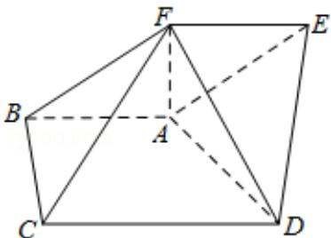

<!-- question-source:start -->
18.（13分）(2009·重庆)如图，在五面体ABCDEF中，AB∥DC，∠BAD= $\frac{\pi}{2}$ ，CD=AD=2，四边形ABFE为平行四边形，FA⊥平面ABCD，FC=3，ED= $\sqrt{7}$ ，求：

（Ⅰ）直线 AB 到平面 EFCD 的距离；

（Ⅱ）二面角 F - AD - E 的平面角的正切值.

<!-- question-source:end -->

![[高中/真题/按年份分类/2009/2009年重庆市高考数学试卷_文科_含答案/解答题/题目/answers/Q00022922A1.md]]
