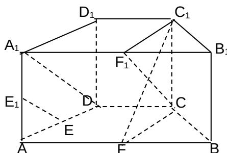
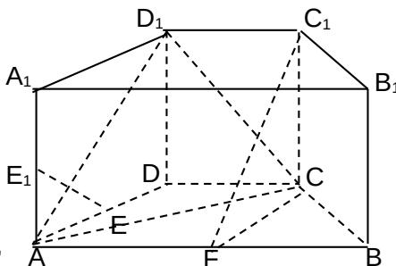

<!-- question-source:start -->
18. (Ⅰ) 证明:

在直四棱柱 ABCD-A B C D 中，取 $A_{1}B_{1}$ 的中点 $F_{1}$ ，

连接 $A_{1}D$ ， $C_1F_1$ ， $CF_{1}$ ，因为 $AB = 4$ ， $CD = 2$ ，且 $AB // CD$ 所以 $CD = A_{1}F_{1}$ ， $A_{1}F_{1}CD$ 为平行四边形，所以 $CF_{1} // A_{1}D$ 又因为E、E分别是棱AD、AA的中点，所以 $EE_{1} // A_{1}D$ 所以 $CF_{1} // EE_{1}$ ，又因为 $EE_{1} \notin$ 平面 $FCC_{1}$ ， $CF_{1} \subset$ 平面 $FCC_{1}$ 所以直线 $EE_{1} //$ 平面 $FCC_{1}$

（II）连接 AC, 在直棱柱中， $CC_{1} \perp$ 平面 ABCD, $AC \subset$ 平面 ABCD, 所以 $CC_{1} \perp AC$ , 因为底面 ABCD 为等腰梯形，AB = 4, BC = 2, F 是棱 AB 的中点, 所以 CF = CB = BF, $\triangle BCF$ 为正三角形， $\angle BCF = 60^{\circ}$ , $\triangle ACF$ 为等腰三角形，且 $\angle ACF = 30^{\circ}$ 所以 AC⊥BC，又因为 BC 与 $CC_{1}$ 都在平面 $BB_{1}C_{1}C$ 内且交于点 C，
所以 AC⊥平面 $BB_{1}C_{1}C$ ，而 $AC \subset$ 平面 $D_{1}AC$ ，
所以平面 $D_{1}AC \perp$ 平面 $BB_{1}C_{1}C$ .

【命题立意】：本题主要考查直棱柱的概念、线面平行和线面垂直位置关系的判定.熟练掌握平行和垂直的判定定理.完成线线、线面位置关系的转化.
<!-- question-source:end -->

![[高中/真题/按年份分类/2009/2009年高考真题数学_文__山东卷__含解析版_/解答题/题目/answers/Q00026230A1.md]]
