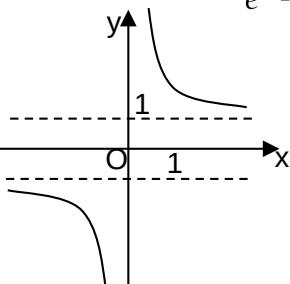
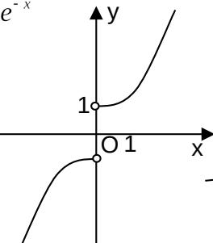
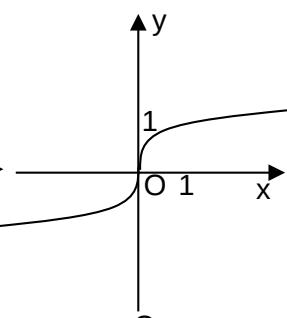
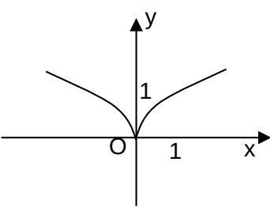

<!-- question-source:start -->
6. 函数 $y=\frac{e^{x}+e^{-x}}{e^{x}-e^{-x}}$ 的图像大致为().

  
D
<!-- question-source:end -->

![[高中/真题/按年份分类/2009/2009年高考真题数学_文__山东卷__含解析版_/选择题/题目/answers/Q00026216A1.md]]
