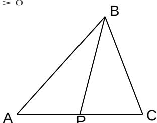

<!-- question-source:start -->
7. 定义在 R 上的函数 $f(x)$ 满足 $f(x)=\left\{\begin{aligned}\log_{2}(4-x), & x\leq0 \\ f(x-1)-f(x-2), & x>0\end{aligned}\right.$ ，则 f
（3）的值为( )

A.-1 B.-2 C.1 D.2

<!-- question-source:end -->

![[高中/真题/按年份分类/2009/2009年高考真题数学_文__山东卷__含解析版_/选择题/题目/answers/Q00029697A1.md]]
