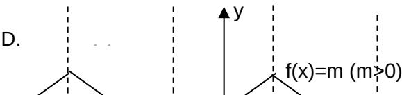

> [!faq]- 2009年高考真题数学【文】(山东卷)（含解析版）解析
>
> > [!success]- **【答案】** 已知 $\alpha, \beta$ 表示两个不同的平面， $m$ 为平面 $\alpha$ 内的一条直线，则“ $\alpha \perp \beta$ ”是“ $m \perp \beta$ ”的（ ）
>
> > [!note]- **【分析】**
> > 本题解析推导如下：
>
> > [!note]- **【解析】**
> > 由平面与平面垂直的判定定理知如果 m 为平面 $\alpha$ 内的一条直线, $m \perp \beta$ , 则 $\alpha \perp \beta$ , 反过来则不
> >
> > 一定.所以“ $\alpha \perp \beta$ ”是“ $m \perp \beta$ ”的必要不充分条件
> >
> > 【命题立意】:本题主要考查了立体几何中垂直关系的判定和充分必要条件的概念.
> >
> > 
