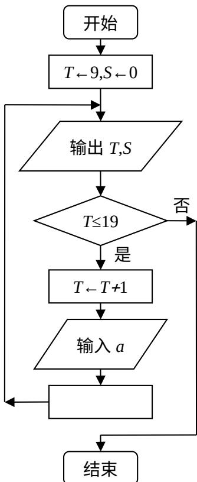

<!-- question-source:start -->
11. 2010 年上海世博会园区每天 9:00 开园，20:00 停止入园。在右边的框图中，S 表示上海世博会官方网站在每个整点报道的入园总人数，a 表示整点报道前 1 个小时内入园人数，则空白的执行框内应填入\_\_\_\_。

<!-- question-source:end -->

![[高中/真题/按年份分类/2010/2010年上海高考数学真题_文科_试卷_word解析版_/填空题/题目/answers/Q00026355A1.md]]
