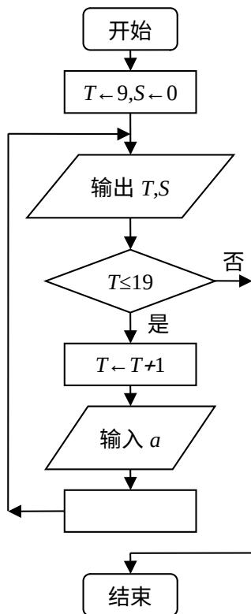

<!-- question-source:start -->
9. 从一副混合后的扑克牌(52 张)中, 随机抽取 1 张, 事件 $A$ 为 “抽得红桃 $\mathrm{K}^{\prime \prime}$ , 事件 $B$ 为 “抽得黑桃”, 则概率 $P(A \cup B) =$ \_\_\_\_ (结果用最简分数表示).

<!-- question-source:end -->

![[高中/真题/按年份分类/2010/2010年上海高考数学真题_文科_试卷_word解析版_/填空题/题目/answers/Q00027907A1.md]]
