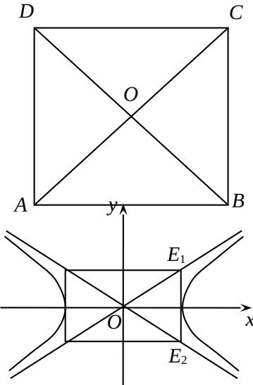

<!-- question-source:start -->
14. 从集合 $U = \{a, b, c, d\}$ 的子集中选出 4 个不同的子集，

需同时满足以下两个条件：

(1) $\varnothing, U$ 都要选出；
<!-- question-source:end -->

![[高中/真题/按年份分类/2010/2010年上海高考数学真题_文科_试卷_word解析版_/填空题/题目/answers/Q00027912A1.md]]
